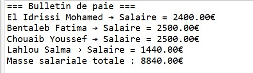
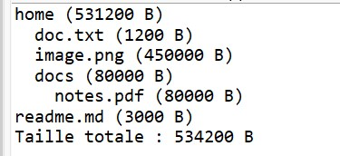

# TP Java – Exercices Divers

## Exercice 1 : Gestion de la paie des employés

### Description
Ce projet simule le calcul des salaires pour différents types d’employés :  
`EmployeHoraire`, `EmployeSalarie` et `Vendeur`.  
La classe `Entreprise` gère dynamiquement un tableau d’employés et affiche les bulletins de paie.

### Fonctionnalités

1. **Création des employés**
   - EmployeHoraire avec taux horaire et heures travaillées
   - EmployeSalarie avec salaire mensuel fixe
   - Vendeur avec salaire mensuel + commission

2. **Gestion de la paie**
   - Calcul du salaire pour chaque employé
   - Affichage des bulletins de paie
   - Calcul de la masse salariale totale

### Résultats du programme

#### Paie des employés

---

## Exercice 2 : Modélisation d’un système de fichiers

### Description
Ce projet modélise un mini-système de fichiers avec des éléments abstraits `FsItem`.  
Chaque élément peut être un fichier (`FileItem`) ou un répertoire (`Directory`) capable de calculer sa taille et d’afficher son contenu.

### Fonctionnalités

1. **Création des fichiers et répertoires**
   - FileItem avec nom et taille
   - Directory avec tableau dynamique d’éléments

2. **Gestion du système**
   - Ajout des fichiers et répertoires
   - Affichage hiérarchique de l’arborescence
   - Calcul de la taille totale

### Résultats du programme

#### Système de fichiers

